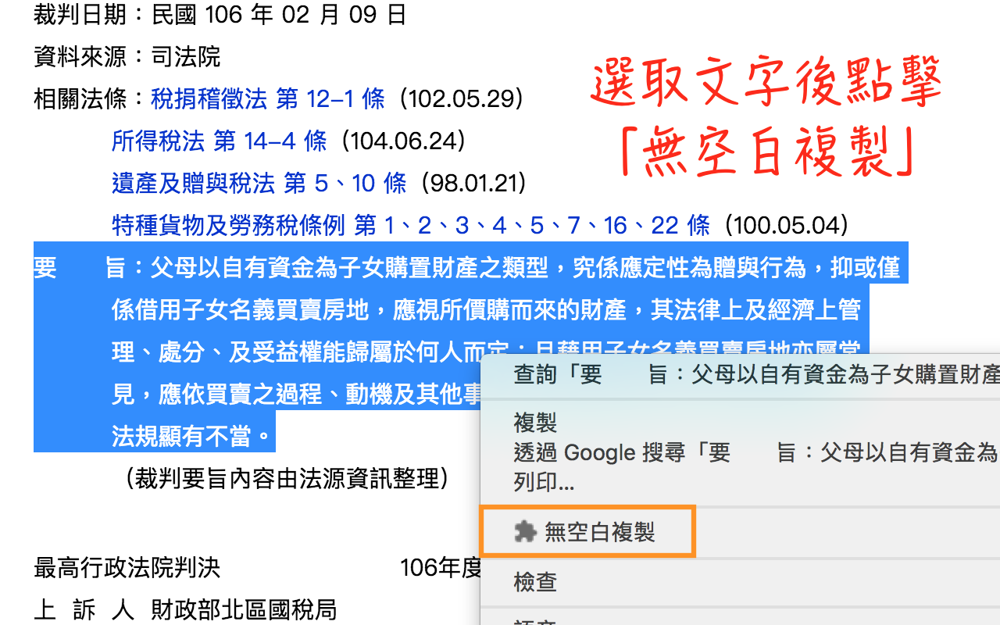

# 司法文書重排版

## 介紹

將司法文書系統所產生格式文字，重新進行排版，輸出純文字。目前支援：

- 司法院網站
- 法源資料庫

## 使用

- 線上版：[前往](https://lisez.github.io/rejdoc/)
- 離線版：[前往](https://github.com/lisez/rejdoc/releases/)
- Chrome擴充功能：[Chrome WebApp Store](https://chrome.google.com/webstore/detail/%E5%8F%B8%E6%B3%95%E6%96%87%E6%9B%B8%E9%87%8D%E6%8E%92%E7%89%88/eegidpmlcbalnjfgklfhblhjfhhljecb?hl=zh-TW)

使用 Chrome擴充功能記得請在文書內容處點擊右鍵，避免判斷失敗。

## 更新

### Chrome 擴充

【1.11】新增：「無空白複製」選取文字自動移除空白並複製。因為Chrome瀏覽器天生限制，選取文字時即為純文字狀態，無法進行排版，只能達到移除空白效果。

