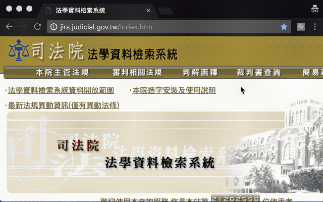

# 司法文書重排版



## 功能介紹

將司法文書系統所產生格式文字，基於語句邏輯重新進行排版，輸出純文字。

以最高行政法院106年1月份第1次庭長法官聯席會議為例，司法院法學資料檢索系統原始文字為：

```text
會議次別：
最高行政法院 106 年 1 月份第 1 次庭長法官聯席會議
決議日期：
民國 106 年 01 月 10 日
資料來源：
司法院
決　　議：
按「行政訴訟之裁判命債務人為一定之給付，經裁判確定後，債務人不為
給付者，債權人得以之為執行名義，聲請地方法院行政訴訟庭強制執行。
」行政訴訟法第 305  條第 1  項定有明文。行政法院為「被告對於原告
之申請，應依本院之法律見解另為適法之處分」之判決，為課予義務訴訟
判決，然亦屬給付判決之一種，所為「命行政機關為處分」之內容，該當
上述所謂「命債務人為一定之給付」，且非不能確定，自得聲請法院為強
制執行。惟作成行政處分乃行使行政權，法院或第三人無從代替行政機關
為之，行政機關怠於履行時，無法採取直接強制或代履行之執行手段，然
執行法院得依行政訴訟法第 306  條第 2  項準用強制執行法第 128  條
第 1  項規定，對行政機關課處怠金及再處怠金，以促使其履行作成處分
之給付義務。
 
法律問題：人民向行政機關依法申請之案件，經行政機關予以駁回，人民經依訴願程
          序後，向行政法院起訴請求該機關應為特定內容之行政處分，經行政法院
          依行政訴訟法第 200  條第 4  款之規定，判決主文諭知：「（第 1  項
          ）訴願決定及原處分撤銷。（第 2  項）被告對於原告之申請，應依本院
          之法律見解另為適法之處分。（第 3  項）原告其餘之訴駁回。」於該判
          決確定後，行政機關未另作處分前，人民以上述確定判決主文第 2  項部
          分為執行名義，向行政法院聲請對行政機關強制執行，行政法院應否准許
          ？
討論意見：甲說（否定說）：
            （一）我國有關課予義務訴訟之規定，雖係仿自德國立法例，惟我國行
                  政訴訟法第 8  編強制執行之規定，僅對撤銷判決、給付訴訟判
                  決之強制執行有明文規定，對於課予義務訴訟判決並未如德國行
                  政法院法第 172  條定有執行之規定，即反覆課予一定數額之強
                  制金之間接強制方法，而行政訴訟法第 5  條請求行政機關應為
                  特定內容之行政處分，性質上行政法院無法對之為直接強制執行
                  ，課予義務訴訟判決自不得作為請求強制執行之執行名義。
            （二）另觀諸本題上述判決主文第 2  項，依行政訴訟法第 200  條第
                  4 款之規定可知，人民該部分之訴雖部分有理由，然因案件事證
                  尚未臻明確，或涉及行政機關之行政裁量決定，法院乃判命行政
                  機關應遵照其判決之法律見解對人民作成行政處分，並非命行政
                  機關為一定給付內容之給付判決，故其判決內容之實現，端賴行
                  政機關以該判決所示之見解為依據，重為處分或決定，或為其他
                  必要之處置，殊非得以該課予義務判決作為執行名義而聲請強制
                  執行。
          乙說（肯定說）：
                本件採取否定說之見解，將使行政法院所為課予義務之判決無從貫
                徹，不僅形成權利保護之漏洞，且與行政訴訟法增訂課予義務訴訟
                之立法意旨未合，行政訴訟法第 305  條之解釋，不宜囿於文義及
                立法理由，而應作目的性解釋，對於所謂「給付判決」之意涵，作
                廣義解釋，使之包括課予義務判決在內，以維人民權利，並使行政
                強制執行體系趨於完備。縱認為課予義務訴訟判決之執行，我國法
                漏未規定，惟課予義務訴訟之本質為給付訴訟，行政法院依行政訴
                訟法第 200  條第 4  款之規定，命行政機關為特定給付內容之行
                政處分或決定之判決，本質上亦為給付判決，應可類推行政訴訟法
                第 305  條之規定，聲請行政法院強制執行，只是其強制執行之方
                法，不能直接強制，代替行政機關作成特定內容之行政處分，惟行
                政法院辦理強制執行事件，依行政訴訟法第 306  條第 2  項之規
                定，既準用強制執行法之規定，對於未遵照確定判決意旨作成行政
                處分之行政機關，依強制執行法第 128  條規定，行政法院得先定
                履行期間命該行政機關依確定判決意旨作成行政處分，逾期未為履
                行者，得對該行政機關反覆處以怠金之間接強制方法，使其自行履
                行義務，亦非不能執行。
表決結果：採乙說（肯定說）之結論。
決    議：如決議文。
          按「行政訴訟之裁判命債務人為一定之給付，經裁判確定後，債務人不為
          給付者，債權人得以之為執行名義，聲請地方法院行政訴訟庭強制執行。
          」行政訴訟法第 305  條第 1  項定有明文。行政法院為「被告對於原告
          之申請，應依本院之法律見解另為適法之處分」之判決，為課予義務訴訟
          判決，然亦屬給付判決之一種，所為「命行政機關為處分」之內容，該當
          上述所謂「命債務人為一定之給付」，且非不能確定，自得聲請法院為強
          制執行。惟作成行政處分乃行使行政權，法院或第三人無從代替行政機關
          為之，行政機關怠於履行時，無法採取直接強制或代履行之執行手段，然
          執行法院得依行政訴訟法第 306  條第 2  項準用強制執行法第 128  條
          第 1  項規定，對行政機關課處怠金及再處怠金，以促使其履行作成處分
          之給付義務。
 
研究意見：                                                第一庭張法官國勳
          1.首先，設題中主文第 1  項「訴願決定及原處分撤銷」部分，由於屬於
            形成判決，且屬於課予義務訴訟判決之附帶宣告，並無強制執行之問題
            ，亦即主文第 1 項不得為聲請強制執行之執行名義，故人民以該確定
            判決主文第 1 項為執行名義聲請強制執行，自不應准許。
          2.設題主文第 2  項「被告對於原告之申請，應依本院之法律見解另為適
            法之處分」部分，人民得否以之為執行名義聲請強制執行？分別從以下
            各個面向予以說明：
         （1）自法理而言：
              法院判決得為強制執行之執行名義者，以給付判決為限。而行政訴訟
              法第 3  條明定行政訴訟包括撤銷訴訟、確認訴訟及給付訴訟，且除
              同法第 4  條及第 6  條分別規定撤銷訴訟及確認訴訟外，同法第 5
              條及第 8  條則分別規定課予義務訴訟及一般給付訴訟，可知課予義
              務訴訟及一般給付訴訟均屬給付訴訟之類型，課予義務訴訟不過係給
              付訴訟之其中一種特殊類型（特別規定）而已。故原則上祇要給付判
              決之內容確定及可能，理論上均得為強制執行之執行名義。
         （2）從文義解釋而言：
              愢按「行政訴訟之裁判命債務人為一定之給付，經裁判確定後，債務
                人不為給付者，債權人得以之為執行名義，聲請地方法院行政訴訟
                庭強制執行。」而在一般民事強制執行實務，無論是財產上給付義
                務或非財產上行為、不行為或容忍義務之執行名義，其聲請人即為
                債權人，相對人即為債務人，亦即強制執行之債權人及債務人，並
                不以財產或非財產給付之請求權人及相對人為限。故行政訴訟法第
                305 條第 1  項所稱「命『債務人』為一定之給付」，其文義應不
                以同法第 8  條第 1  項之一般給付訴訟之確定判決為限，此由同
                法第 8  條第 1  項亦包括「請求作成行政處分以外之其他非財產
                上之『給付』」之用語，可見「作成行政處分」亦屬「給付」之一
                種〔試想豈有依第 8  條第 1  項請求行政機關作成不發生法律效
                果之行政指導（例如：提供氣象預報）或事實行為（例如：拖吊違
                停車輛），得強制執行，請求行政機關作成發生法律效果之行政處
                分，卻不得強制執行之理？〕，準此，行政訴訟法第 305  條第 1
                項所稱「命債務人為一定之給付」之文義射程範圍，解釋上自應包
                括「命行政機關另行作成適法之處分」之情形，而得直接適用於課
                予義務判決之強制執行。（此與乙說主張得類推適用第 305  條第
                1 項規定不同）
              𥴰我國法既未特別規定課予義務判決之強制執行程序，自應適用行政
                訴訟法第 305  條針對給付判決強制執行之一般規定，而非因此即
                謂不得針對課予義務判決聲請強制執行，否則豈非判命行政機關應
                為特定內容行政處分之主文亦不得聲請強制執行？
         （3）從給付判決之確定及可能而言：給付判決必須確定及可能，人民始得
              以之為執行名義聲請強制執行。
              愢觀諸主文第 2  項之內容，至少於「被告應另為處分」此一範圍內
                ，堪認已達到具體明確之程度，執行法院僅須強制行政機關履行作
                成行政處分之義務即可，至於行政機關所為之行政處分是否符合確
                定判決所表示之法律見解，則非所問。
              𥴰所謂給付判決內容「可能」，係指判決內容在主觀上及客觀上均可
                能實現之意，於本題情形，包括行政機關有無作成行政處分之可能
                ，以及執行法院有無強制執行之手段。前者，作成行政處分本即為
                行政機關之職權事項，固無疑義；後者，執行法院應先依行政訴訟
                法第 305  條第 2  項、第 3  項規定，定期命行政機關履行（履
                行期限如法無明文，則得類推適用訴願法第 2  條第 2  項所定之
                2 個月），且載明逾期不履行者，強制執行之意旨（即所謂「告戒
                」），並通知其上級機關督促其履行，又因法院或第三人無從代替
                行政機關履行（作成行政處分），而無法採取直接強制或代履行之
                強制執行手段，故如行政機關仍不履行時，執行法院得依行政訴訟
                法第 306  條第 2  項準用強制執行法第 128  條第 1  項規定，
                對行政機關課處怠金及再處怠金，惟性質上不得對機關代表人或承
                辦人予以管收。
              㕙最後，從德國行政法院法第 172  條針對課予義務判決（包括該法
                第 113  條第 5  項第 1  句判命行政機關作成特定之職務行為及
                第 2  句判命行政機關依法院裁判意旨作成決定）定有反覆課處怠
                金之間接強制執行的特別規定（註一）而言，可見德國法上亦肯認
                設題主文第 2  項之課予義務判決為確定、可能而得為執行名義。
         （4）從權利保護之必要性而言：
              此一問題源自於今年高等行政法院法律座談會的提案 10 ，提案機關
              高雄高等行政法院於會議中口頭補充說明當事人遇到行政機關於法院
              判決撤銷訴願決定及原處分確定後，遲遲不依判決意旨另行作成行政
              處分，導致非但人民之實體權利無法實現，亦無從續行有效之救濟程
              序（如行政機關未依法調查審認作成處分，人民縱得提起怠為處分之
              課予義務訴訟，行政法院仍無法進行實質審判）的無奈困境，除造成
              法院判決的形骸化、空洞化，嚴重損害法院判決之威信，更使「有權
              利，必有救濟」之法治國原則淪為空談。故實有必要賦予上開課予義
              務判決主文之執行力，以貫徹法院所為課予義務判決之效力，並確保
              人民之訴訟權及實體權利。
          註一：德國行政法院法第 172  條規定：「在第 113  條第 1  項第 2 
                句及第 5  項及第 123  條之情形，行政機關不履行判決或假處分
                所定之義務者，第一審法院得基於聲請，以裁定對其指定期間，為
                一萬歐元以下怠金之告戒，期間屆滿而無結果者，予以科處，並依
                職權執行之。怠金得重覆告戒、科處及執行之。」而同法第 113
                條第 5  項規定：「拒為或怠為行政處分違法，並因此侵害原告之
                權利時，如事件已達可裁判之程度，法院應判決行政機關有作成原
                告所申請職務行為之義務。如未達可裁判之程度，法院應宣示，行
                政機關依法院裁判意旨對原告作成。」引自陳敏博士等譯《德國行
                政法院法逐條釋義》，91  年 10 月司法院印行。
```

重新排版則顯示為：

```
會議次別：
最高行政法院106年1月份第1次庭長法官聯席會議
決議日期：
民國106年01月10日
資料來源：
司法院
決議：
按「行政訴訟之裁判命債務人為一定之給付，經裁判確定後，債務人不為給付者，債權人得以之為執行名義，聲請地方法院行政訴訟庭強制執行。
」行政訴訟法第305條第1項定有明文。行政法院為「被告對於原告之申請，應依本院之法律見解另為適法之處分」之判決，為課予義務訴訟判決，然亦屬給付判決之一種，所為「命行政機關為處分」之內容，該當上述所謂「命債務人為一定之給付」，且非不能確定，自得聲請法院為強制執行。惟作成行政處分乃行使行政權，法院或第三人無從代替行政機關為之，行政機關怠於履行時，無法採取直接強制或代履行之執行手段，然執行法院得依行政訴訟法第306條第2項準用強制執行法第128條第1項規定，對行政機關課處怠金及再處怠金，以促使其履行作成處分之給付義務。
法律問題：人民向行政機關依法申請之案件，經行政機關予以駁回，人民經依訴願程序後，向行政法院起訴請求該機關應為特定內容之行政處分，經行政法院依行政訴訟法第200條第4款之規定，判決主文諭知：「（第1項）訴願決定及原處分撤銷。（第2項）被告對於原告之申請，應依本院之法律見解另為適法之處分。（第3項）原告其餘之訴駁回。」於該判決確定後，行政機關未另作處分前，人民以上述確定判決主文第2項部分為執行名義，向行政法院聲請對行政機關強制執行，行政法院應否准許？
討論意見：甲說（否定說）：
（一）我國有關課予義務訴訟之規定，雖係仿自德國立法例，惟我國行政訴訟法第8編強制執行之規定，僅對撤銷判決、給付訴訟判決之強制執行有明文規定，對於課予義務訴訟判決並未如德國行政法院法第172條定有執行之規定，即反覆課予一定數額之強制金之間接強制方法，而行政訴訟法第5條請求行政機關應為特定內容之行政處分，性質上行政法院無法對之為直接強制執行，課予義務訴訟判決自不得作為請求強制執行之執行名義。
（二）另觀諸本題上述判決主文第2項，依行政訴訟法第200條第4款之規定可知，人民該部分之訴雖部分有理由，然因案件事證尚未臻明確，或涉及行政機關之行政裁量決定，法院乃判命行政機關應遵照其判決之法律見解對人民作成行政處分，並非命行政機關為一定給付內容之給付判決，故其判決內容之實現，端賴行政機關以該判決所示之見解為依據，重為處分或決定，或為其他必要之處置，殊非得以該課予義務判決作為執行名義而聲請強制執行。
乙說（肯定說）：
本件採取否定說之見解，將使行政法院所為課予義務之判決無從貫徹，不僅形成權利保護之漏洞，且與行政訴訟法增訂課予義務訴訟之立法意旨未合，行政訴訟法第305條之解釋，不宜囿於文義及立法理由，而應作目的性解釋，對於所謂「給付判決」之意涵，作廣義解釋，使之包括課予義務判決在內，以維人民權利，並使行政強制執行體系趨於完備。縱認為課予義務訴訟判決之執行，我國法漏未規定，惟課予義務訴訟之本質為給付訴訟，行政法院依行政訴訟法第200條第4款之規定，命行政機關為特定給付內容之行政處分或決定之判決，本質上亦為給付判決，應可類推行政訴訟法第305條之規定，聲請行政法院強制執行，只是其強制執行之方法，不能直接強制，代替行政機關作成特定內容之行政處分，惟行政法院辦理強制執行事件，依行政訴訟法第306條第2項之規定，既準用強制執行法之規定，對於未遵照確定判決意旨作成行政處分之行政機關，依強制執行法第128條規定，行政法院得先定履行期間命該行政機關依確定判決意旨作成行政處分，逾期未為履行者，得對該行政機關反覆處以怠金之間接強制方法，使其自行履行義務，亦非不能執行。
表決結果：採乙說（肯定說）之結論。
決議：如決議文。
按「行政訴訟之裁判命債務人為一定之給付，經裁判確定後，債務人不為給付者，債權人得以之為執行名義，聲請地方法院行政訴訟庭強制執行。
」行政訴訟法第305條第1項定有明文。行政法院為「被告對於原告之申請，應依本院之法律見解另為適法之處分」之判決，為課予義務訴訟判決，然亦屬給付判決之一種，所為「命行政機關為處分」之內容，該當上述所謂「命債務人為一定之給付」，且非不能確定，自得聲請法院為強制執行。惟作成行政處分乃行使行政權，法院或第三人無從代替行政機關為之，行政機關怠於履行時，無法採取直接強制或代履行之執行手段，然執行法院得依行政訴訟法第306條第2項準用強制執行法第128條第1項規定，對行政機關課處怠金及再處怠金，以促使其履行作成處分之給付義務。
研究意見：第一庭張法官國勳
1.首先，設題中主文第1項「訴願決定及原處分撤銷」部分，由於屬於形成判決，且屬於課予義務訴訟判決之附帶宣告，並無強制執行之問題，亦即主文第1項不得為聲請強制執行之執行名義，故人民以該確定判決主文第1項為執行名義聲請強制執行，自不應准許。
2.設題主文第2項「被告對於原告之申請，應依本院之法律見解另為適法之處分」部分，人民得否以之為執行名義聲請強制執行？分別從以下各個面向予以說明：
（1）自法理而言：法院判決得為強制執行之執行名義者，以給付判決為限。而行政訴訟法第3條明定行政訴訟包括撤銷訴訟、確認訴訟及給付訴訟，且除同法第4條及第6條分別規定撤銷訴訟及確認訴訟外，同法第5條及第8條則分別規定課予義務訴訟及一般給付訴訟，可知課予義務訴訟及一般給付訴訟均屬給付訴訟之類型，課予義務訴訟不過係給付訴訟之其中一種特殊類型（特別規定）而已。故原則上祇要給付判決之內容確定及可能，理論上均得為強制執行之執行名義。
（2）從文義解釋而言：愢按「行政訴訟之裁判命債務人為一定之給付，經裁判確定後，債務人不為給付者，債權人得以之為執行名義，聲請地方法院行政訴訟庭強制執行。」而在一般民事強制執行實務，無論是財產上給付義務或非財產上行為、不行為或容忍義務之執行名義，其聲請人即為債權人，相對人即為債務人，亦即強制執行之債權人及債務人，並不以財產或非財產給付之請求權人及相對人為限。故行政訴訟法第305條第1項所稱「命『債務人』為一定之給付」，其文義應不以同法第8條第1項之一般給付訴訟之確定判決為限，此由同法第8條第1項亦包括「請求作成行政處分以外之其他非財產上之『給付』」之用語，可見「作成行政處分」亦屬「給付」之一種〔試想豈有依第8條第1項請求行政機關作成不發生法律效果之行政指導（例如：提供氣象預報）或事實行為（例如：拖吊違停車輛），得強制執行，請求行政機關作成發生法律效果之行政處分，卻不得強制執行之理？〕，準此，行政訴訟法第305條第1項所稱「命債務人為一定之給付」之文義射程範圍，解釋上自應包括「命行政機關另行作成適法之處分」之情形，而得直接適用於課予義務判決之強制執行。（此與乙說主張得類推適用第305條第1項規定不同）𥴰我國法既未特別規定課予義務判決之強制執行程序，自應適用行政訴訟法第305條針對給付判決強制執行之一般規定，而非因此即謂不得針對課予義務判決聲請強制執行，否則豈非判命行政機關應為特定內容行政處分之主文亦不得聲請強制執行？
（3）從給付判決之確定及可能而言：給付判決必須確定及可能，人民始得以之為執行名義聲請強制執行。
愢觀諸主文第2項之內容，至少於「被告應另為處分」此一範圍內，堪認已達到具體明確之程度，執行法院僅須強制行政機關履行作成行政處分之義務即可，至於行政機關所為之行政處分是否符合確定判決所表示之法律見解，則非所問。
𥴰所謂給付判決內容「可能」，係指判決內容在主觀上及客觀上均可能實現之意，於本題情形，包括行政機關有無作成行政處分之可能，以及執行法院有無強制執行之手段。前者，作成行政處分本即為行政機關之職權事項，固無疑義；後者，執行法院應先依行政訴訟法第305條第2項、第3項規定，定期命行政機關履行（履行期限如法無明文，則得類推適用訴願法第2條第2項所定之2個月），且載明逾期不履行者，強制執行之意旨（即所謂「告戒」），並通知其上級機關督促其履行，又因法院或第三人無從代替行政機關履行（作成行政處分），而無法採取直接強制或代履行之強制執行手段，故如行政機關仍不履行時，執行法院得依行政訴訟法第306條第2項準用強制執行法第128條第1項規定，對行政機關課處怠金及再處怠金，惟性質上不得對機關代表人或承辦人予以管收。
㕙最後，從德國行政法院法第172條針對課予義務判決（包括該法第113條第5項第1句判命行政機關作成特定之職務行為及第2句判命行政機關依法院裁判意旨作成決定）定有反覆課處怠金之間接強制執行的特別規定（註一）而言，可見德國法上亦肯認設題主文第2項之課予義務判決為確定、可能而得為執行名義。
（4）從權利保護之必要性而言：此一問題源自於今年高等行政法院法律座談會的提案10，提案機關高雄高等行政法院於會議中口頭補充說明當事人遇到行政機關於法院判決撤銷訴願決定及原處分確定後，遲遲不依判決意旨另行作成行政處分，導致非但人民之實體權利無法實現，亦無從續行有效之救濟程序（如行政機關未依法調查審認作成處分，人民縱得提起怠為處分之課予義務訴訟，行政法院仍無法進行實質審判）的無奈困境，除造成法院判決的形骸化、空洞化，嚴重損害法院判決之威信，更使「有權利，必有救濟」之法治國原則淪為空談。故實有必要賦予上開課予義務判決主文之執行力，以貫徹法院所為課予義務判決之效力，並確保人民之訴訟權及實體權利。
註一：德國行政法院法第172條規定：「在第113條第1項第2句及第5項及第123條之情形，行政機關不履行判決或假處分所定之義務者，第一審法院得基於聲請，以裁定對其指定期間，為一萬歐元以下怠金之告戒，期間屆滿而無結果者，予以科處，並依職權執行之。怠金得重覆告戒、科處及執行之。」而同法第113條第5項規定：「拒為或怠為行政處分違法，並因此侵害原告之權利時，如事件已達可裁判之程度，法院應判決行政機關有作成原告所申請職務行為之義務。如未達可裁判之程度，法院應宣示，行政機關依法院裁判意旨對原告作成。」引自陳敏博士等譯《德國行政法院法逐條釋義》，91年10月司法院印行。
```

## 使用方式

- 線上版：[前往](https://lisez.github.io/rejdoc/)
- 離線版：[前往](https://github.com/lisez/rejdoc/releases/)
- Chrome擴充功能：
  - [Chrome WebApp Store](https://chrome.google.com/webstore/detail/%E5%8F%B8%E6%B3%95%E6%96%87%E6%9B%B8%E9%87%8D%E6%8E%92%E7%89%88/eegidpmlcbalnjfgklfhblhjfhhljecb?hl=zh-TW)
  - [GitHub](https://github.com/lisez/rejdoc-gc)
